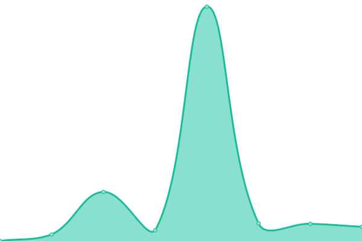
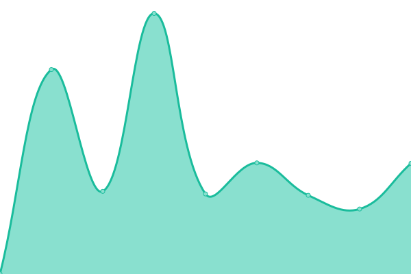

# [📈 Live Status](https://instances.kazi.one): <!--live status--> **🟩 All systems operational**

This repository contains the open-source uptime monitor and status page for [Kazi](https://instances.kazi.one), powered by [Upptime](https://github.com/upptime/upptime).

With [Upptime](https://upptime.js.org), you can get your own unlimited and free uptime monitor and status page, powered entirely by a GitHub repository. We use [Issues](https://github.com/kzshantonu/instances/issues) as incident reports, [Actions](https://github.com/kzshantonu/instances/actions) as uptime monitors, and [Pages](https://instances.kazi.one) for the status page.

<!--start: status pages-->
<!-- This summary is generated by Upptime (https://github.com/upptime/upptime) -->
<!-- Do not edit this manually, your changes will be overwritten -->
<!-- prettier-ignore -->
| URL | Status | History | Response Time | Uptime |
| --- | ------ | ------- | ------------- | ------ |
|  [nttr.stream](https://nttr.stream) | 🟩 Up | [nttr-stream.yml](https://github.com/kzshantonu/instances/commits/HEAD/history/nttr-stream.yml) | 

 344ms
     
 | 

<a href="https://instances.kazi.one/history/nttr-stream">100.00%</a>
    

|  [leddit.xyz](https://leddit.xyz) | 🟩 Up | [leddit-xyz.yml](https://github.com/kzshantonu/instances/commits/HEAD/history/leddit-xyz.yml) | 

 1089ms
     
 | 

<a href="https://instances.kazi.one/history/leddit-xyz">100.00%</a>
    

|  [de.nttr.stream](https://de.nttr.stream) | 🟩 Up | [de-nttr-stream.yml](https://github.com/kzshantonu/instances/commits/HEAD/history/de-nttr-stream.yml) | 

 659ms
     
 | 

<a href="https://instances.kazi.one/history/de-nttr-stream">100.00%</a>
    

|  [de.leddit.xyz](https://de.leddit.xyz) | 🟩 Up | [de-leddit-xyz.yml](https://github.com/kzshantonu/instances/commits/HEAD/history/de-leddit-xyz.yml) | 

 2932ms
     
 | 

<a href="https://instances.kazi.one/history/de-leddit-xyz">100.00%</a>
    

|  [send](https://send.mni.li) | 🟩 Up | [send.yml](https://github.com/kzshantonu/instances/commits/HEAD/history/send.yml) | 

 971ms
     
 | 

<a href="https://instances.kazi.one/history/send">100.00%</a>
    

<!--end: status pages-->

[**Visit our status website →**](https://instances.kazi.one)

## 📄 License

- Powered by: [Upptime](https://github.com/upptime/upptime)
- Code: [MIT](./LICENSE) © [Kazi](https://instances.kazi.one)
- Data in the `./history` directory: [Open Database License](https://opendatacommons.org/licenses/odbl/1-0/)
